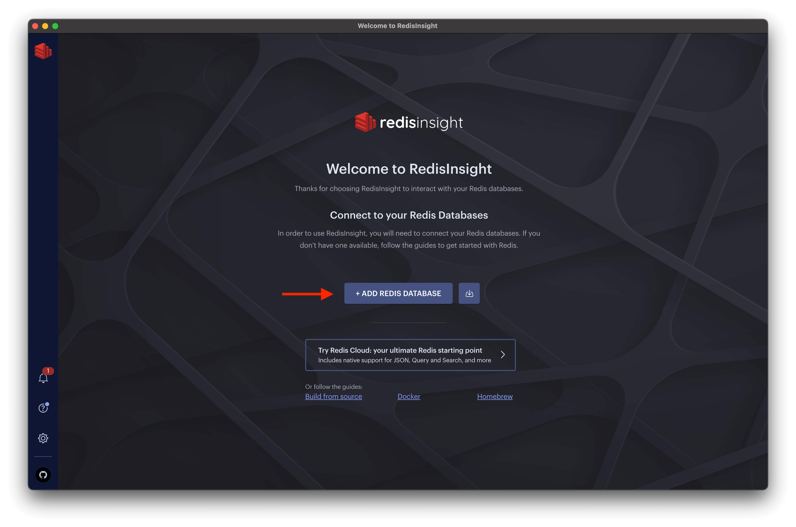
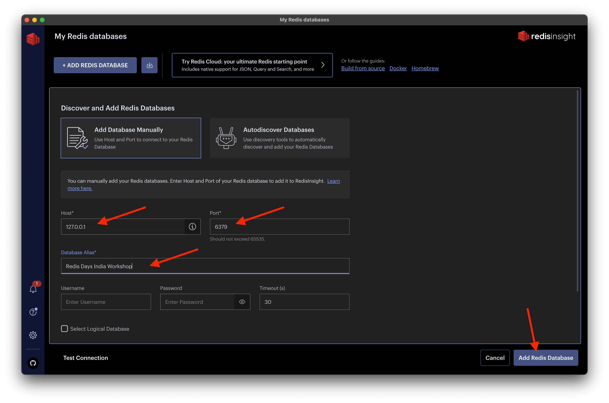
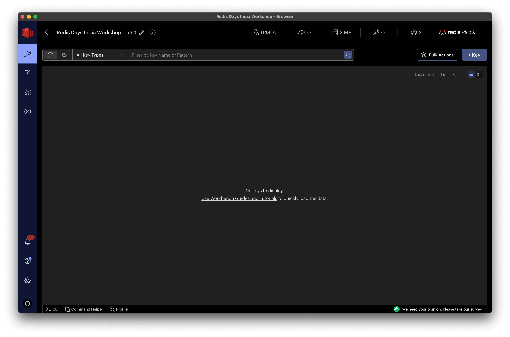
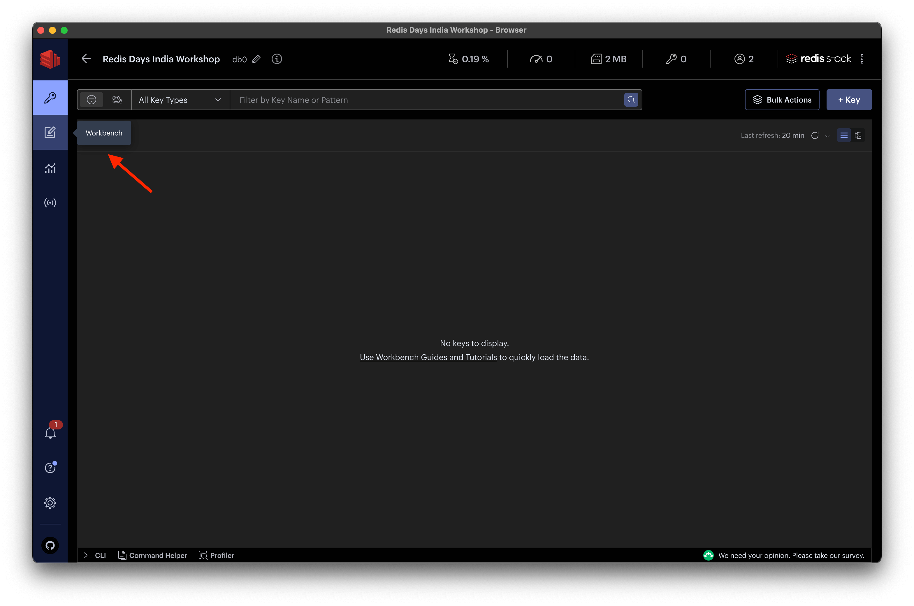
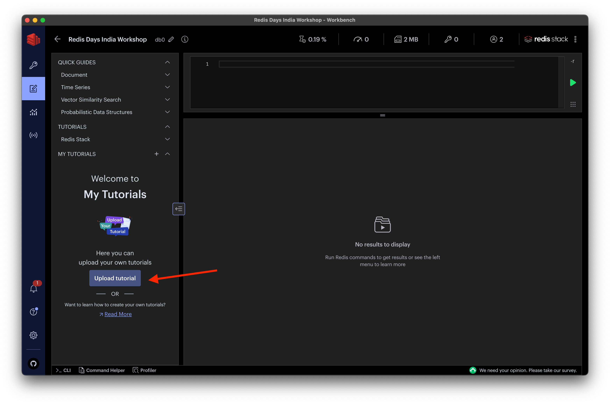
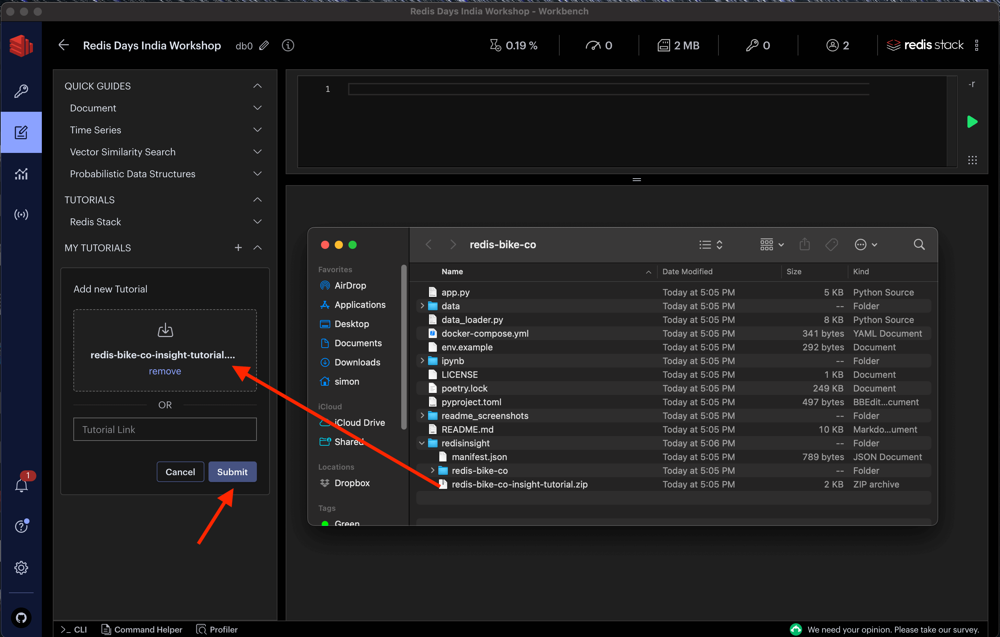
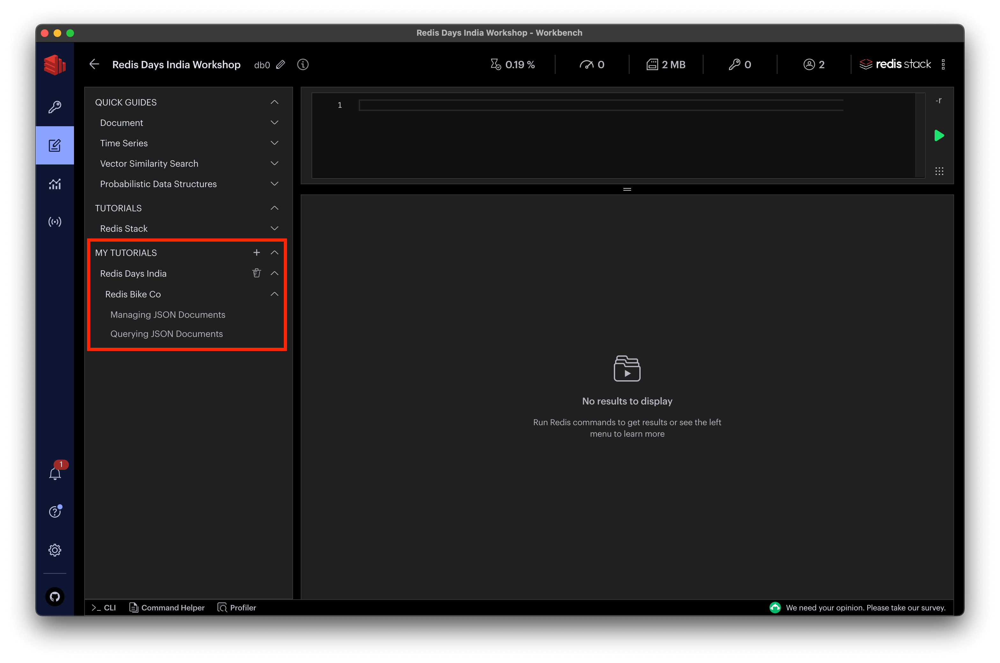
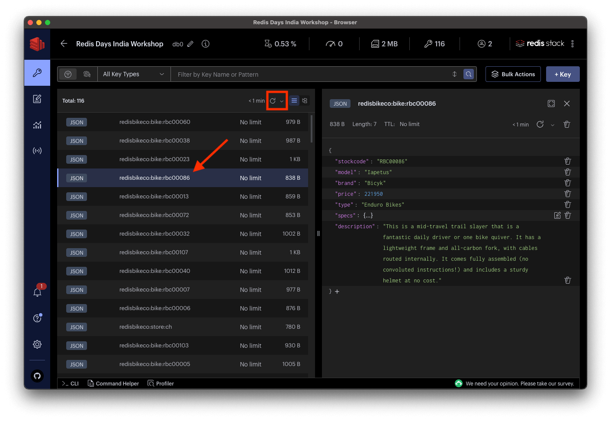
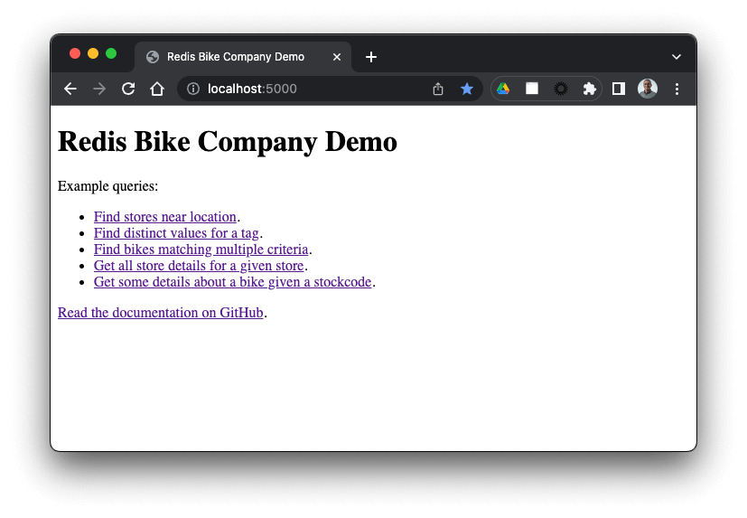
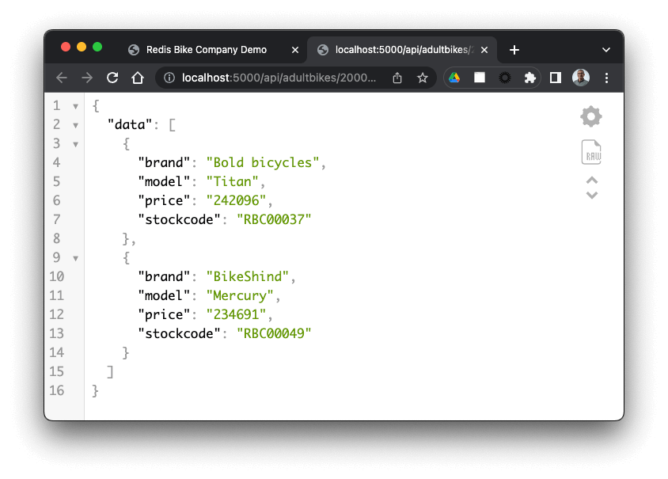

# Redis Bike Company Example Application

This is the code repository that accompanies the [Redis Days India 2023](https://redis.com/redisdays/india/) workshop video.  It contains everything that you need to follow along with the presenters to explore storing and searching JSON documents with [Redis Stack](https://redis.io/docs/about/about-stack/) - including vector similarity search.

The code is written in Python and uses the [redis-py](https://github.com/redis/redis-py) Redis client.  You don't need to be a Python expert to run it and understand the concepts.  Not a Python developer?  Don't worry - these concepts can be applied equally in other programming languages: for example with the [node-redis](https://github.com/redis/node-redis) client for Node.js, [jedis](https://github.com/redis/jedis) for Java or [NRedisStack](https://github.com/redis/NRedisStack) for C#.

# Overview

There are two parts to this workshop and they share a common data model.  Imagine we're operating a chain of bicycle stores located around India.  We want to use Redis to store information about each store, and each type of bike that we sell.

We'll keep the details of each store in its own JSON document, and organize them so that their keys are named `redisbikeco:store:<storecode>`.  For example, our store in Chennai has the store code `CH` so its key will be:

```
redisbikeco:store:ch
```

For each store, we'll maintain a data model that looks like this:

```json
{ 
   "storecode": "CH",
   "storename": "Chennai",
   "address": {
      "street": "Arcot Road",
      "city": "Chennai",
      "state": "Tamil Nadu",
      "pin": "600026",
      "country": "India"
   },
   "position": "80.2057207,13.0511065",
   "amenities": [
      "parking", "rentals", "repairs"
   ]
}
```

Each type of bike that we sell will also have its own JSON document in Redis.  The key for a bike will be `redisbikeco:bike:<stockcode>` where stock code is a unique identifier for the bike - for example `rbc00001`.

Here's what the bike data model looks like:

```json
{
   "stockcode": "RBC00001",
   "model": "Deimos",
   "brand": "Ergonom",
   "price": 184950,
   "type": "Enduro Bikes",
   "specs": {
      "material": "alloy",
      "weight": 14.0
   },
   "description": "Redesigned for the 2020 model year, this bike impressed our testers and is the best all-around trail bike we've ever tested. It has a lightweight frame and all-carbon fork, with cables routed internally. It's for the rider who wants both efficiency and capability."
}
```

In the first part of the workshop [Simon Prickett](https://twitter.com/simon_prickett) (Principal Developer Advocate at Redis) walks you through how to store, retrieve and update these documents in a Redis Stack instance.  Simon also covers indexing these documents and using the powerful capabilities of Redis Stack Search to query them in ways that you wouldn't think possible using a key/value database.

[Brian Sam-Bodden](https://twitter.com/bsbodden) is a Senior Developer Advocate at Redis.  In the second part of the workshop, Brian explains the concepts behind vector similarity search and shows how to perform searches over the bicycle data set in Redis Stack.

If you want to try out the vector similarity examples, first follow the instructions in "Setting up your Environment" and "Loading the Sample Data" here. Then, check out the separate [README](ipynb/README.md) in the `ipynb` folder of this repository for vector similarity search.

# Setting up your Environment

To run the code locally, you'll need to install and setup a few things:

* Python 3 (if you don't have a recent version of Python, [grab one here](https://www.python.org/downloads/).  We've tested on Python 3.10)
* Poetry (dependency manager for Python - [read the installation instructions here](https://python-poetry.org/docs/#installation))
* Docker Desktop ([read the installation instructions here](https://www.docker.com/products/docker-desktop/)) - we use this to provide you with a Redis Stack instance.
* Git command line tools (the `git` command).  Get these from [the Git website](https://git-scm.com/downloads) if needed.
* RedisInsight - a graphical tool for viewing and managing data in Redis.  [Download a free copy here](https://redis.com/redis-enterprise/redis-insight/) or get it from the Apple App Store if you're on a Macintosh.

We'll assume that you've downloaded/installed the pre-requisites above, and explain how to configure them as needed in the remainder of this README.

## Cloning this Repository

At the terminal, clone the repository to your local machine:

```bash
git clone https://github.com/redis-developer/redis-bike-co.git
```

Then, change directory into the repository folder:

```bash
cd redis-bike-co
```

We assume that your terminal's current directory is this folder for all subsequent commands.

## Installing Python Dependencies

We're using the Poetry tool to manage Python virtual environments and dependencies.  Install the dependencies that this workshop uses with the following command:

```bash
poetry install
```

This installs the dependencies needed for this part of the workshop, and those for the [vector similarity search](./ipynb/README.md) part.  Expect to see output similar to this:

```bash
Creating virtualenv redis-bike-co-_T_fhuK9-py3.10 in /Users/simon/Library/Caches/pypoetry/virtualenvs
Installing dependencies from lock file

Package operations: 134 installs, 0 updates, 0 removals

  • Installing six (1.16.0)
  • Installing attrs (23.1.0)
  • Installing platformdirs (3.8.0)
... similar output...
```

## Creating an Environment File

The code uses a `.env` file to store configuration information.  We've provided an example file that you should be able to use without needing to make any changes.

Copy this into place:

```bash
cp env.example .env
```

Note that `.env` files may contain secrets such as Redis passwords, API keys etc.  Add them to your `.gitignore` file and don't commit them to source control!  We've done that for you in this repository.

## Starting a Redis Stack Instance

We've provided a Docker Compose file for you to run an instance of Redis Stack locally.  This will run on the default Redis port: 6379.  If you have another instance of Redis running on this port, be sure to shut it down first.

Start Redis Stack like this:

```bash
docker-compose up -d
```

You should see output similar to the following:

```bash
...
Starting redis-bike-co ... done
```

## Configuring RedisInsight

Now it's time to configure RedisInsight to point at your local Redis Stack instance and also load a workbook containing example queries for the workshop.

Start RedisInsight and you'll see the welcome screen:



Click the "ADD REDIS DATABASE" button, then check that the value for "Host" is "127.0.0.1" and that the value for "Port" is 6379.  These should be the defaults, you shouldn't need to change them.  Finally set the value of "Database Alias" to be "Redis Days India Workshop" and click the "Add Redis Database" button:



You should see one connection in your list of Redis databases.  Click on "Redis Days India Workshop":


You're now connected to your (empty) Redis Stack instance.  



Finally, add the workbook tutorial for this workshop.  Click the "Workbench" icon:



In the Workbench view, click the "Upload tutorial" button:



Drag the file `redisinsight/redis-bike-co-insight-tutorial.zip` from your local clone of this repository onto the file target:


Then click the "Submit" button:



Now you should have a new tutorial called "Redis Days India".  Watch the workshop video to see how to run the sample commands and queries contained in the tutorial.



Leave RedisInsight running and continue to the next step to load some data...

# Loading the Sample Data

Let's load the sample bikes and stores data into Redis Stack.  This step also builds the search indices that you'll use to query the data from RedisInsight and the Python sample application.

Run the data loader like this:

```bash
poetry run python data_loader.py
```

You should see output similar to the following:

```
Connecting to Redis.
Deleting any existing data with redisbikeco prefix.
Dropping any existing search indices.
Creating search index for bikes.
Creating store search index.
Loading bike data.
redisbikeco:bike:rbc00001 - Ergonom Deimos
redisbikeco:bike:rbc00002 - Tots Vanth
redisbikeco:bike:rbc00003 - Bold bicycles Kirk
redisbikeco:bike:rbc00004 - Nord Phoebe
redisbikeco:bike:rbc00005 - BikeShind Telesto
... many more bikes...
Loaded 111 bikes into Redis.
Loading store data.
redisbikeco:store:ch - Chennai
redisbikeco:store:ko - Kochi
redisbikeco:store:be - Bengaluru
redisbikeco:store:mu - Mumbai
redisbikeco:store:ka - Kanpur
Loaded 5 stores into Redis.
Verifying data...
Data verification checks completed OK.
```

Now you have data in your Redis Stack instance, go back to RedisInsight, hit the refresh button and you should see 116 keys appear.  Click on a key to see the JSON document stored at that key.  Here we've chosen `redisbikeco:bike:rbc00086`.



# Running the Example Application

This repository also contains a sample application written in Python using the Flask framework.  You don't need to know about Flask to try this out, but if you're interested you can learn more about it from its [documentation here](https://palletsprojects.com/p/flask/).

Start the application like this:

```bash
poetry run flask run
```

You should see output similar to the following:

```bash
 * Debug mode: off
WARNING: This is a development server. Do not use it in a production deployment. Use a production WSGI server instead.
 * Running on http://127.0.0.1:5000
Press CTRL+C to quit
```

Use your browser to navigate to `http://localhost:5000`.



From here, you can click on the links to run the sample queries and see their output in the browser. Click on "Find bikes matching multiple criteria":



Here, we're using an extension to the Chrome browser that renders JSON nicely.  If you'd like to use that, you can add it to Chrome [here](https://chrome.google.com/webstore/detail/json-viewer/gbmdgpbipfallnflgajpaliibnhdgobh).  Similar extensions are available for other browsers.

# Need Help or Want to Chat?

If you need help with this workshop, or just want to chat with us about the concepts and how you plan to use them in your own projects then we'd love to see you on the [Redis Discord](https://discord.gg/redis).  There's a `` channel just for this event, and lots of other channels for everything from help with different programming languages to promoting your own projects and finding a job.